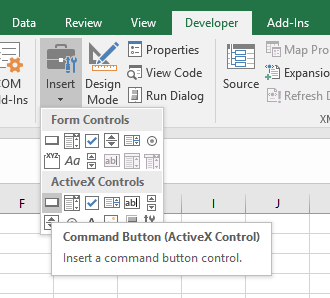
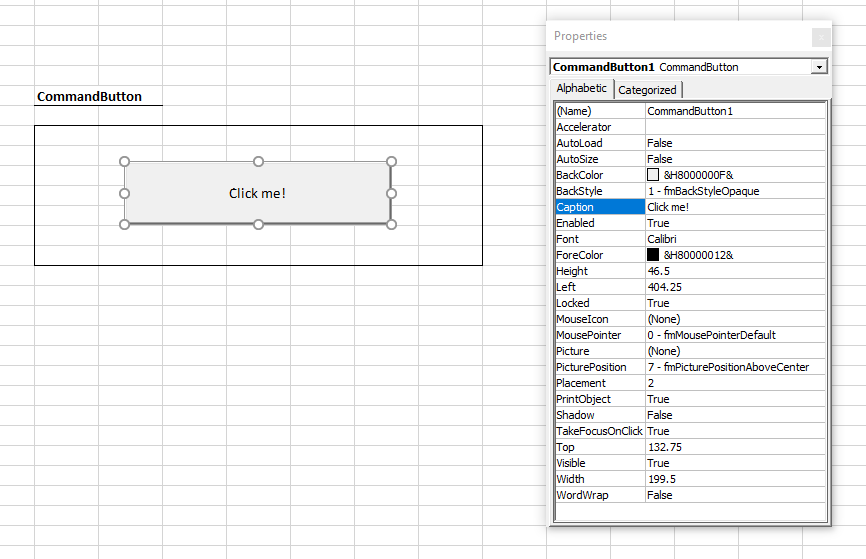

# ActiveX Controls

Popular ActiveX controls inside MS Excel include:

name | description
--- | ---
[`CommandButton`](command-buttons/notes.md) | A clickable button.
`ToggleButton` | A button which maintains either a pressed or unpressed state (like a light switch).
`ComboBox` (drop-down) | A drop-down menu which allows the user to choose one option from a provided list.
`ListBox` | A picker menu which allows the user to choose one option from a provided list.
`SpinButton` | A set of arrows which allow the user to increment or decrement an integer value.
`ScrollBar` | A fluid scale which allows the user to increment or decrement an integer value.
`OptionButton` (radio button) | A selectable circle belonging to a specified group from which only one may be selected at any given time.
`CheckBox` | A checkable box belonging to a specified group from which zero or more may be selected at any given time.

## Insertion

Insert any ActiveX Control via the "Developer" > "Insert" menu. 

## Properties

Each control has a certain set of properties which govern its behavior.

Access any given control's properties from the "Developer" > "Properties" menu, or by right-clicking on the control and selecting "Properties".

All controls have a `(Name)` property which uniquely identifies the control by a friendly name. The control's name also acts as the name of a Visual Basic variable which allows programmatic access to the control's properties. When you create a new control of a given type, that control's default name will be the name of the control with an integer suffix (e.g. `CommandButton1`). The names of subsequent controls will increment the integer value (e.g. `CommandButton2` and `CommandButton3`). If you decide to rename a given control, make sure to cascade that name change across all references to that control.

Most controls have a `Value` property which provides programmatic access to the control's state.

Many controls have a `Caption` property which specifies written text to be displayed to the user.

Many controls have a `LinkedCell` property which bidirectionally associates that control's value with the value of a cell you specify. Be careful when allowing users to enter values in these linked cells because they might make a mistake. Reference: [how to protect or hide certain cells](https://support.microsoft.com/en-us/help/214081/xl-how-to-lock-individual-cells-in-a-worksheet).

Certain "choose from a list" controls have a property called `ListFillRange` which specifies a range of cells to populate the control's selectable options.

## Events

Most controls respond to `Click` events. Some also respond to `Change` events.

Write Visual Basic code inside a specially named sub-procedure (`Private Sub [ControlName]_[EventName] ... End Sub`) to specify logic which should be executed any time a given event is triggered on a given control.
