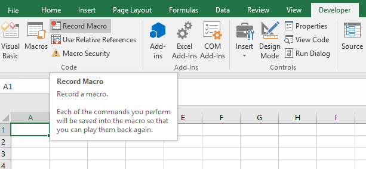
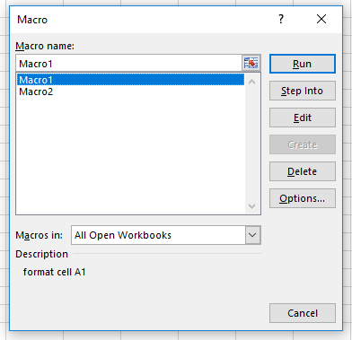

# Visual Basic Programming

## Macros

### Recording Macros

  1. Click "Developer" > "Record Macro", then assign it a unique name and optional description.
  2. Manually perform one or more actions via the front-end MS Excel interface.
  3. Click "Developer" > "Stop Recording".



See also: [Getting Started with VBA - Recording a Macro](https://msdn.microsoft.com/en-us/vba/office-shared-vba/articles/getting-started-with-vba-in-office#to-record-a-macro).

### Executing Macros

Execute a macro manually by selecting it from the "Developer" > "Macros" menu and pressing "Run". 



Or execite it programmatically in VBA by using the keyword `Call` followed by the name of the macro. For example:

```vba
Call Macro1
```