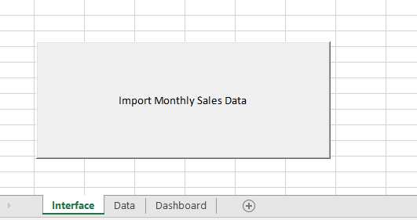
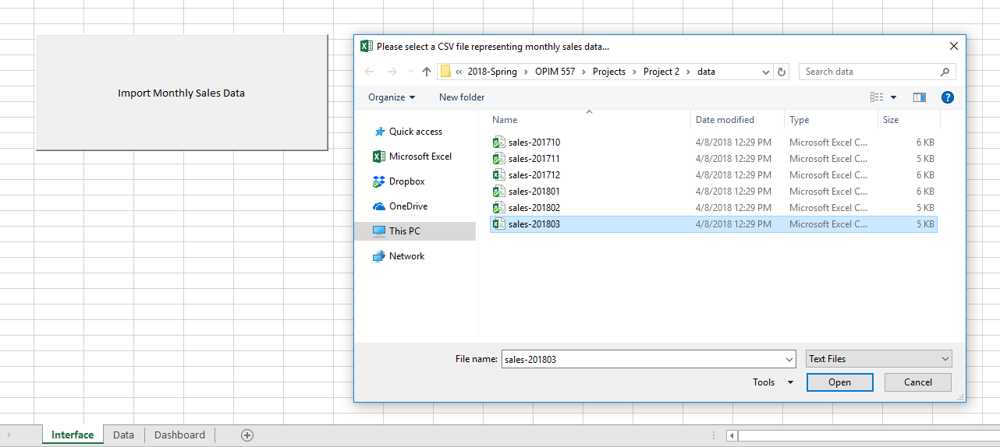
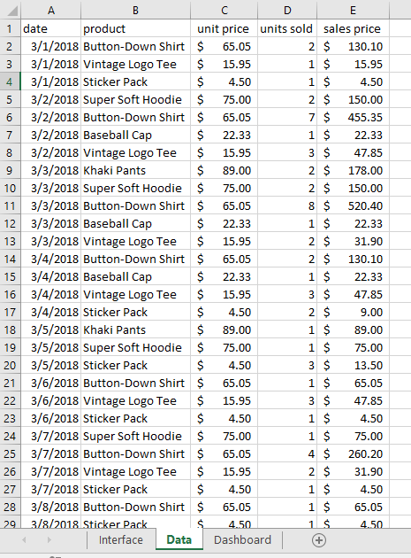
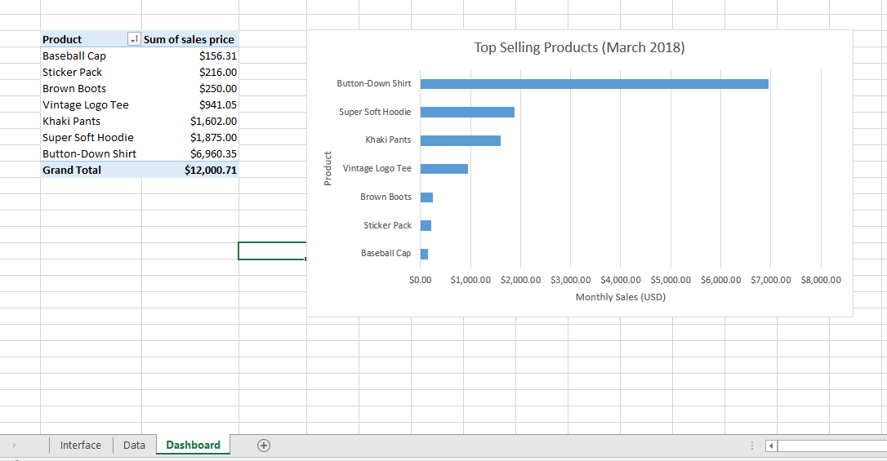

# Executive Dashboard

Assume you own and operate an online retail business. At monthly board meetings, you meet with your top investors and advisors to discuss the company's strategic direction, set priorities, and allocate resources. To aid this decision-making process, the board has requested you provide them with a monthly summary report of business insights, including the aggregation of total sales and identification of top-selling products.

Luckily, at the end of each calendar month, the online platform your company uses to sell its products makes available for download from its admin interface a CSV file representing all individual sales orders for that month. But usually you only have a few hours from when the data becomes available to when you are required to turn it around and share the resulting insights with the board. Over the past few months, this report compilation process has been somewhat stressful and vulnerable to manual error. And the board's confidence in your operational leadership is dependent not only on your ability to meet sales goals, but also on your ability to provide them with accurate and timely information.

So your objective is to create a tool which automates the process of transforming monthly sales data into a report of business insights. This report should be formatted as a data dashboard which utilizes charts and graphs to tell a compelling story.

## Learning Objectives

  1. Design and build a tool to automate manual efforts and aid a decision-making process.
  2. Find practical applications for learning new programming concepts, primarily importing data from CSV files.

## Instructions

Create a new macro-enabled workbook named **`netid`-exec-dash.xlsm**, where `netid` is your university-issued net identifier (i.e. the first part of your university-issued email address).

Rename the first sheet to "Interface". Create a new blank worksheet called "Data" and another called "Dashboard".

Download the [example monthly sales CSV files](data/) for use during the development process. Your submission should be able to process any of these CSV files in any order. The expected name for any of these files resembles "sales-`YYYYMM`.csv", where `YYYY` represents the year and `MM` represents the month number. The expected CSV headers for any of these files are: `date`, `product`, `unit price`, `units sold`, and `sales price`, in that order, assumed to exist on the very first row in the CSV file. The professor will use similar files when evaluating your submission.

Your submission should adhere to the following requirements, as detailed in the corresponding sections below:

  + Interface Requirements
  + Information Input Requirements
  + Validation Requirements
  + Calculation Requirements
  + Information Output Requirements

## Requirements

### Interface Requirements

When the user opens the workbook, they should see a sheet called "Interface" with nothing but an "Import Monthly Sales Data" button and some helpful instructions.

### Information Input Requirements

When the user clicks the "Import Monthly Sales Data" button, they should be prompted to select a local CSV file representing monthly sales data.

> Hint: there are many ways to do this, but try using `Application.GetOpenFileName()`.

### Validation Requirements

The program should proceed in one of the following ways, depending on the outcome of the CSV file-selection process:

  A. If the user cancels their selection, the program should stop execution and display a friendly error message like "Oh, expecting you to select a data file. Please try again."

  B. Otherwise, if the user selects a data file that contains invalid/unexpected header rows, the program should stop execution and display a friendly error message like "Oh, the selected file contains unexpected headers. Please try again."

  C. Otherwise, if the user selects a CSV file with valid headers, the program should open it and copy its contents to the "Data" sheet, and proceed with execution.

> Hint: there are many ways to do this, but try using `Application.Workbooks.Open()` to open the CSV file, then reference it like any other Worksheet object.

> Hint: fully clear the contents and formatting of all cells on the "Data" sheet before writing any new data there.

### Calculation Requirements

Using whatever MS Excel and/or Visual Basic Programming capabilities you would like, the program should somehow process and aggregate the raw data into various summary tables, charts, and graphs. The comprehensiveness and accuracy of these aggregations, calculations, and representations comprises the "Calculation Requirements" grade.

### Information Output Requirements

The final versions of these information outputs should appear on the "Dashboard" sheet, which the user should see when the program finishes execution. This information should include at least the following items:

  1. Total monthly sales for the business, equivalent to the sum of total monthly sales for each product, formatted as USD with a dollar sign and two decimal places (e.g. "Total Monthly Sales: $12,000.71").
  2. A list of the top selling products, and total monthly sales for each, formatted as USD with a dollar sign and two decimal places (e.g. "Button-Down Shirt: $6,960.35", "Super Soft Hoodie: $1,875.00", etc.).
  3. At least one visual chart or graph depicting this or related information to support the project objectives. The title of at least one chart should include a textual representation of the respective month (e.g. "March 2018"), which should update based on whichever file was imported.

> Hint: try manually configuring a Pivot Table and corresponding Pivot Chart after you import data for the first time, and write code to update the underlying data source (Pivot Cache) on subsequent imports.

> Hint: to detect the month and year, either parse the filename, or parse the imported date values.

Wherever price-related information (e.g. unit prices and sales prices) appears in the workbook, it should be formatted as USD, with a dollar sign and two decimal places. This includes in cell values on the "Data" sheet, and in charts, tables, and graphs on the "Dashboard" sheet.

## Submission Instructions

Upload your workbook file to Canvas:

  + [Section 40 Project Upload](https://georgetown.instructure.com/courses/54379/assignments/123535)
  + [Section 41 Project Upload](https://georgetown.instructure.com/courses/54380/assignments/123532)

## Evaluation Methodology

Submissions will be evaluated based on ability to meet each of the component requirements (see corresponding sections above for detailed instructions):

Category | Weight
--- | ---
Interface Requirements | 10%
Information Input Requirements | 15%
Validation Requirements | 25%
Calculation Requirements | 20%
Information Output Requirements | 30%

This rubric is tentative, and may be subject to slight adjustments during the grading process.

The professor reserves the right to award extra credit in recognition of particularly effective user experiences. Common elements that may be eligible for extra credit include: simplicity of user interface, clarity of user instructions, and exceeding basic expectations set forth here for auto-updating charts and graphics. Also eligible for extra credit are submissions which expand the scope of this project to import multiple monthly sales files and compare sales across months.
